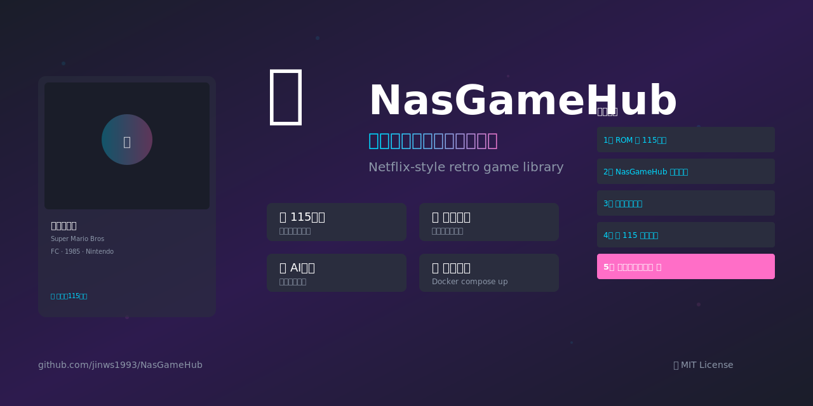
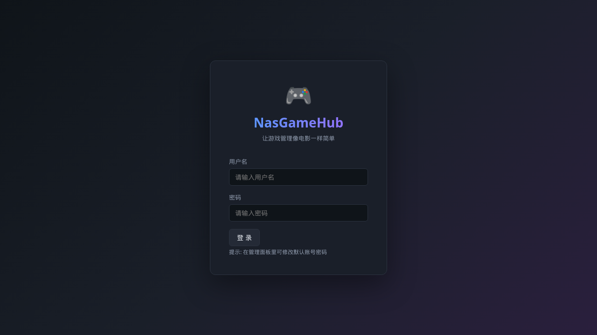
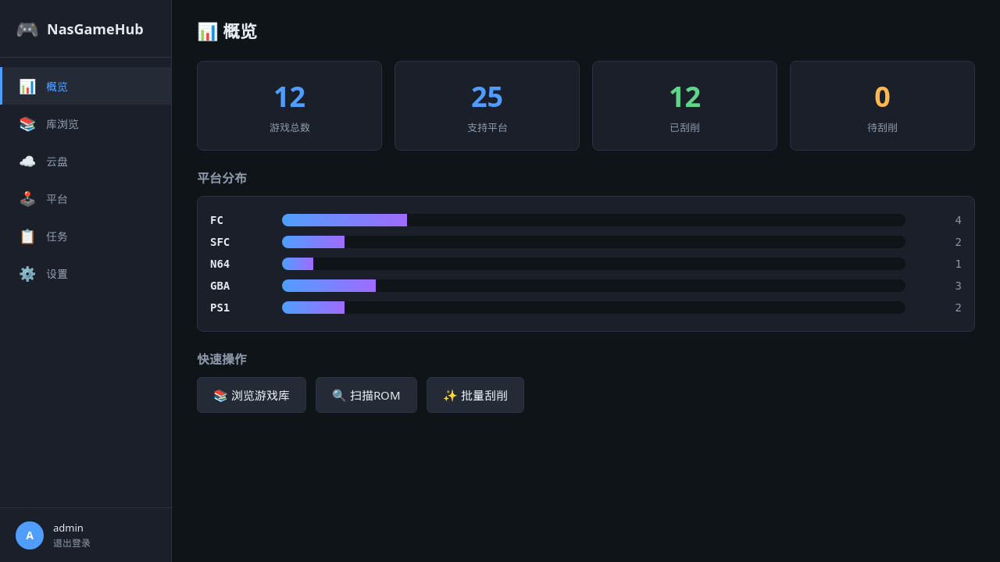

# CloudGameHub - 装个 APK 就能玩的私人游戏库



> **Your retro game library lives in your 115 cloud. One APK, no server, no NAS.**
>
> 📦 ROM 放 115 网盘 · 装个 APK · 点一下就开玩 · 玩完删掉也不心疼

[](https://developer.android.com/)
[](https://kotlinlang.org/)
[](https://developer.android.com/jetpack/compose)
[](https://www.retroarch.com/)
[](https://115.com/)
[]()
[](LICENSE)
[](https://github.com/jinws1993/CloudGameHub/stargazers)

[简体中文](#简体中文) · [English](#english)

---

## ⚠️ 架构调整公告 (2026-10)

**CloudGameHub 就是一个 APK —— 不需要 NAS, 不需要服务器, 不需要注册。**

```
旧:  115 → NAS (Docker 服务端) → Android 客户端
新:  115 → Android 客户端 (装完就能用)
```

| 变化 | 说明 |
|------|------|
| 不再需要 NAS | 装一个 APK 就能用, 不用起 Docker、不用公网 IP |
| 不再有服务器 | 服务端的扫描 / 刮削 / 115 代理 / 库管理逻辑全部移植进 App |
| 不再有账号 | 不用注册登录, 只有 115 自己的 cookie, 且只存在本机 |
| 下载链路更短 | 115 → 手机 直连 (302), 不再经过 NAS 中转 |

**本仓库里的 `server/` 和 `client-windows/` 目前保留但已停更**, 作为历史实现参考。
新功能全部集中在 `client-android/`。

> 📌 本项目 v1.3.0 之前叫 **NasGameHub**。包名从 `com.nasgame` 改成了 `com.cloudgamehub`,
> 所以装过旧版的话需要先卸载再装。签名密钥刻意没改 (见 `client-android/keys/README.md`)。

详细说明见 **[client-android/README.md](client-android/README.md)**。

---

## 简体中文 (旧版: NAS 部署方案)

CloudGameHub 是一个**部署在 NAS / Linux 上的私人游戏库管家**，深度集成 **115 网盘**作为游戏 ROM 的天然存放和分发中心——把游戏 ROM 存在 115 上，CloudGameHub 自动连接并整理为漂亮游戏库；**手机客户端一键点下，ROM 就直接下载到手机本地模拟器开玩**。中间不占 NAS 硬盘，下载流量走 115，玩游戏完全本地。

### 🎬 典型场景：115 网盘 → 手机本地游玩

```
1. 你在 115 网盘上有一个 /roms/FC/、/roms/SFC/、/roms/PS1/... 的目录
2. CloudGameHub 扫码连上你的 115 账号
3. 后台自动扫描 115 目录结构 → AI + ScreenScraper 刮削封面/简介/中文译名
4. 手机打开 Android 客户端 → 看到与《斗破黑夜》一样的漂亮游戏列表
5. 点游戏 → ROM 从 115 高速下载到手机本地 (走 115 CDN)
6. 自动唤起对应平台模拟器 → 画面加载 → 开玩
```

整个流程 **NAS 上几乎零磁盘占用**，**不用预先批量下载整个 ROM 库到 NAS**。手机没 ROM 用时随时从 115 拉一个。



### ✨ 主要功能

- **📂 115 网盘深度集成**：扫码登录、目录浏览 (支持子目录点进)、批量后台导入+刮削、远程分发到客户端下载
- **🎯 自动扫描归类**：把任意结构的 ROM 文件夹，按扩展名/目录自动识别到 25 个平台
- **🎨 AI 智能刮削**：ScreenScraper.fr + OpenAI 兼容 API 双引擎，**AI 优先**，自动翻译中文译名/简介
- **📱 客户端远程下载 ROM**：Android / Windows 客户端点一下游戏，ROM 从 115 直接下到本地模拟器开玩
- **🖼️ 手动上传封面**：AI/SS 都找不到时手动上传
- **🚀 Web UI 远程游玩**：浏览器内 Moonlight 串流，或唤起客户端模拟器


- **🔐 多用户权限**：管理员 / 普通用户两级

- 🎯 **自动扫描归类**：把任意结构的 ROM 文件夹，按扩展名/目录自动识别到 25 个平台 (FC/SFC/N64/GBA/PS1/PS2/PSP/Wii/GC/DC/Saturn/MD/3DS/NDS/J2ME/街机/...)
- 🎨 **AI 智能刮削**：使用 ScreenScraper.fr + OpenAI 兼容 API 双引擎，**AI 优先**识别不规范的中文/英文文件名
- 🖼️ **封面管理**：刮削源找不到时，**支持用户手动上传**封面图
- ☁️ **115 网盘集成**：直接从 115 云盘扫描并导入 ROM（支持子目录浏览，CID 全程字符串避免精度丢失）
- 🚀 **Web UI 远程游玩**：浏览器内 Moonlight 串流，或一键唤起客户端模拟器
- 🔐 **多用户权限**：管理员 / 普通用户两级，Web UI 默认 14322 端口
- 📱 **Android / Windows 客户端**：原生应用，可远程启动游戏

### 🏗️ 架构

```
┌──────────────────────────────────────┐                ┌─────────────────────────┐
│         Android / Windows 客户端     │                │       第三方数据源       │
│   (远程唤起模拟器 / Moonlight 串流)  │ ────HTTP/WS───▶│ ScreenScraper.fr       │
└──────────────────────────────────────┘                │ OpenAI 兼容 API         │
                          │                              │ 115 网盘开放 API        │
                          │                              └─────────────────────────┘
                          ▼
┌──────────────────────────────────────────────────────────────────────┐
│                  CloudGameHub Docker 容器                              │
│   ┌────────────┐  ┌──────────────┐  ┌──────────────┐  ┌────────┐  │
│   │ FastAPI 后端│  │ SQLite 数据库│  │  媒体文件    │  │ ROM 库  │  │
│   │   (uvicorn) │  │  (data/db)   │  │ (data/media) │  │(data/  │  │
│   │             │  │              │  │              │  │  roms) │  │
│   └────────────┘  └──────────────┘  └──────────────┘  └────────┘  │
└──────────────────────────────────────────────────────────────────────┘
                          │
                          ▼
                  ┌──────────────┐
                  │   Web UI     │  ← Vue 3 SPA
                  │  浏览器访问  │
                  └──────────────┘
```

### 🚀 一键安装 (Docker)

**前提**：Linux NAS / 飞牛 OS / Debian / Ubuntu + Docker 20.10+ + Docker Compose v2。

```bash
git clone https://github.com/<你的用户名>/CloudGameHub.git
cd CloudGameHub

# 1. 复制环境变量模板, 按需修改
cp .env.example .env
nano .env       # ← 修改 AI key / 管理员密码等

# 2. 启动
docker compose up -d

# 3. 浏览器访问 http://NAS_IP:14322/
#    默认账号: admin / admin123 (首次登录后会强制改密码)
```

#### 构建离线镜像 (可选)

如果你的 NAS **无法访问外网 / PyPI**，可以预下载 Python 虚拟环境打包进镜像：

```bash
# 在有网的机器上:
python3.11 -m venv build_venv
source build_venv/bin/activate
pip install -r server/requirements.txt
tar -cf venv.tar -C build_venv .
# 把 venv.tar 复制到 CloudGameHub 项目根目录, 再 docker build
```

如果项目根目录有 `venv.tar`，Dockerfile 会优先使用；没有就走 `pip install -r requirements.txt`。

### 📖 完整文档

- **[INSTALL.md](docs/INSTALL.md)** — 详细安装步骤（含飞牛 OS、Linux、Windows WSL）
- **[USAGE.md](docs/USAGE.md)** — 使用手册（首次配置、扫描、刮削、自定义名字搜索、115 集成、客户端）
- **[DEVELOPMENT.md](docs/DEVELOPMENT.md)** — 开发指南（API、数据库 schema、自定义平台）
- **[SECURITY.md](docs/SECURITY.md)** — 安全注意事项

### 🤝 贡献

欢迎 PR！请阅读 [DEVELOPMENT.md](docs/DEVELOPMENT.md) 后再提 PR。

### 📄 许可证

[MIT](LICENSE) — 请勿用于商业闭源分发。

---

### 📱 Android 客户端

[`client-android/`](client-android/) 是 **Kotlin + Jetpack Compose + Hilt + Retrofit** 写的原生安卓客户端：

- **登录** — 服务器地址 / 用户名 / 密码
- **游戏库** — 按平台分类 Tab 切换 + 卡片网格 + 实时搜索排序
- **下载 ROM** — OkHttp `followRedirects` 跟 302 跳到 115 CDN, 走 App 私有目录, 不占用户可见存储
- **启动模拟器** — `Intent.ACTION_VIEW` + `FileProvider` 唤起 RetroArch/PPSSPP/ePSXe/DraStic/Citra/Mupen64Plus 等第三方模拟器
- **进度条 + 后台队列** — 信号量限流 (默认 2 并发, 用户可改)
- **下载管理页** — 队列状态 / 本地 ROM 列表 / 一键清缓存
- **设置** — 为每个平台手动配置模拟器包名, 自动检测常用包
- **串流游玩** (实验) — WebSocket H.264 视频流 + MediaCodec 硬解码

#### 构建客户端

**方式 1 — Android Studio (推荐)**
```
1. 打开 Android Studio (Hedgehog 2023.1.1 或更新)
2. File → Open → 选择 client-android/ 目录
3. 等待 Gradle sync (首次 5-10 分钟, 下载 SDK + 依赖)
4. Build → Build Bundle(s) / APK(s) → Build APK(s)
5. APK 输出: client-android/app/build/outputs/apk/debug/app-debug.apk
```

**方式 2 — 命令行**
```bash
cd client-android
./gradlew assembleDebug
# APK: app/build/outputs/apk/debug/app-debug.apk
```

**方式 3 — GitHub Actions (云端编译, 无需本地 Android SDK)**
Push 到 main 分支后, 自动编译并上传 APK 到 Artifacts。详见 `.github/workflows/android.yml`。

#### 推荐模拟器包名

| 平台 | 模拟器 | 包名 |
|---|---|---|
| FC/N64/MD/GBA/GB/GBC | RetroArch | `com.retroarch` |
| SFC | Snes9x EX+ | `com.explusalpha.Snes9xPlus` |
| PS1 | Duckstation | `com.github.stenzek.duckstation` |
| PSP | PPSSPP | `org.ppsspp.ppsspp` |
| NDS | DraStic (付费) | `com.drastic` |
| 3DS | Azahar / Citra | `org.citra.citra_emu` |
| PS2 | AetherSX2 | `xyz.aethersx2` |
| DC | Flycast | `com.flycastEmu.flycast` |
| WII/GC | Dolphin | `org.dolphinemu.dolphinemu` |
| 街机 | MAME4droid / FBNeo | `com.explusalpha.MameEmu` |

打开设置页给对应平台填一个上面包名即可。


---

### ⭐ 如果觉得有用，请点个 Star！

- 这个 repo 是本人 NAS 私用项目整理出的可用版本，**完全免费 + 开源**
- 一颗 Star = 给我继续开发的动力 ☕
- 提 Issue / PR 都很欢迎
- 看 [CONTRIBUTING.md](CONTRIBUTING.md) 了解如何贡献

### 🤝 致谢 / Thanks

- [ScreenScraper.fr](https://www.screenscraper.fr/) — 游戏元数据
- [libretro-database](https://github.com/libretro/libretro-database) — LibRetro 元数据
- [Vue.js](https://vuejs.org/) · [FastAPI](https://fastapi.tiangolo.com/) · [SQLAlchemy](https://www.sqlalchemy.org/) — 基础框架
- [115 网盘](https://115.com/) — 云盘集成接口
- 所有贡献者和反馈用户

---

## English

**CloudGameHub** turns your messy retro game ROM collection into a beautiful, Netflix-style game library. It's deeply integrated with **115 cloud disk** (China's biggest personal cloud storage) so ROMs live in your 115 cloud, get auto-organized into a scraped library, and **download straight to a local emulator on your phone or PC with a single tap** — almost zero NAS disk used, traffic routed through 115's CDN.

### 🎬 The typical flow: 115 cloud → local play

1. You keep ROMs in a 115 cloud folder (e.g. `/roms/FC/`, `/roms/SFC/`, `/roms/PS1/`)
2. CloudGameHub scans the directory tree, scrapes covers + Chinese/English titles + summaries via AI + ScreenScraper
3. Your phone opens the Android client and sees a Netflix-style game library
4. Tap a game → ROM streams down from 115 → emulator launches automatically → you play locally

No pre-bulk-downloading the ROM library to your NAS. Your phone downloads only what you play, when you play it.

### ✨ Highlights

- **📂 115 cloud disk deep integration** — QR-code login, subdirectory navigation, background import, push-to-client delivery
- **📱 Client-side ROM download** — Android/Windows clients pull ROMs straight from 115 to local emulators
- **🎯 Automatic scanning & classification** — 25 platforms by extension/folder
- **🎨 Dual-engine scraping** — ScreenScraper.fr + LLM, AI runs first when enabled
- **Manual cover upload** — If neither source finds a cover, users can upload one
- **115 cloud disk** support — Browse and import directly from your 115 cloud, with full path navigation (CID strings avoid JS Number precision loss)
- **Remote play** — Browser Moonlight streaming or one-click client emulator launch
- **Multi-user** — Admin / regular user roles
- **Native clients** — Android (8+) and Windows (10+)

### 🚀 One-line install

```bash
git clone https://github.com/<your-username>/CloudGameHub.git
cd CloudGameHub
cp .env.example .env       # edit AI key, admin password, etc.
docker compose up -d
# Visit http://NAS_IP:14322/   (default admin / admin123, password change on first login)
```

For air-gapped NAS setups, pre-build `venv.tar` (see INSTALL.md) and drop it in the project root; the Dockerfile prefers it over `pip install`.

### 📖 Documentation

- **[INSTALL.md](docs/INSTALL.md)** — Detailed install (FnOS / Debian / Ubuntu / WSL)
- **[USAGE.md](docs/USAGE.md)** — User manual (first-run config, scanning, scraping, custom name search, 115 integration, clients)
- **[DEVELOPMENT.md](docs/DEVELOPMENT.md)** — Developer guide (REST API, DB schema, custom platforms)
- **[SECURITY.md](docs/SECURITY.md)** — Security notes

### 🤝 Contributing

PRs welcome. Read [DEVELOPMENT.md](docs/DEVELOPMENT.md) first.

### 📄 License

[MIT](LICENSE). Please do not redistribute commercially without attribution.